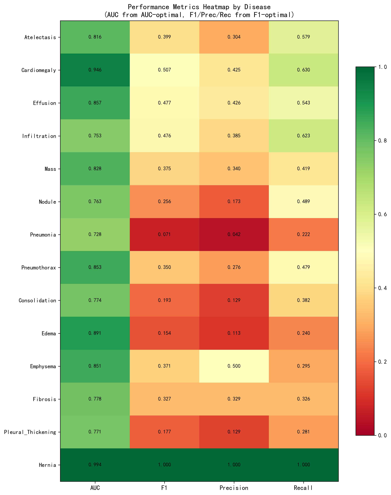
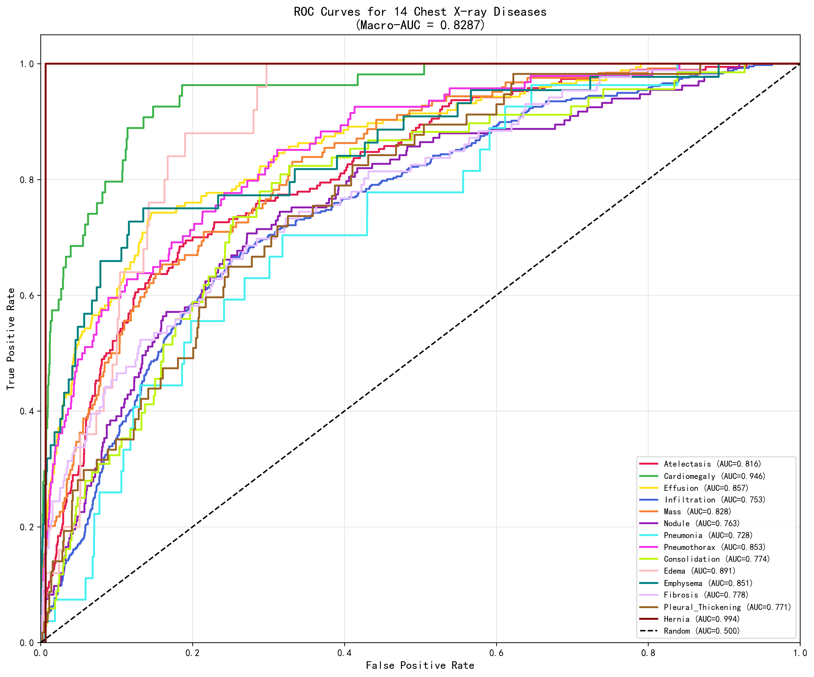
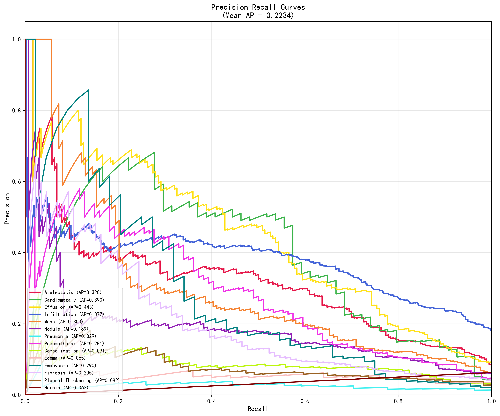
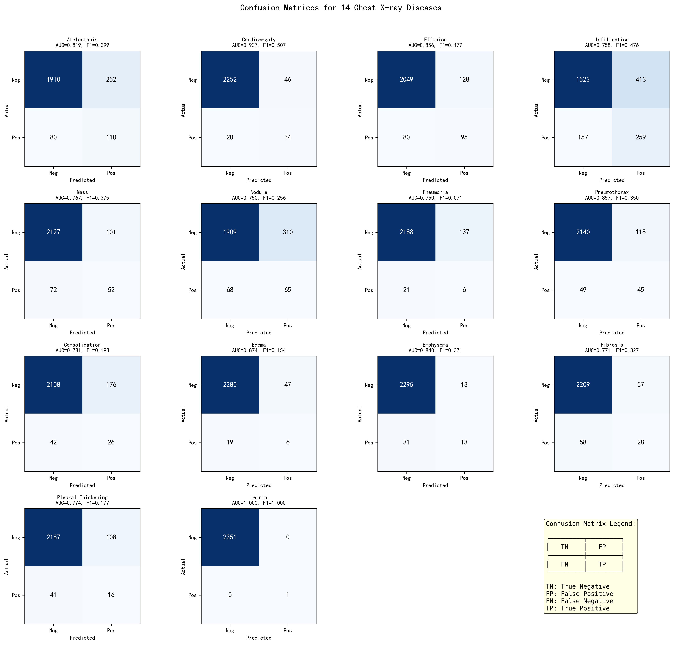
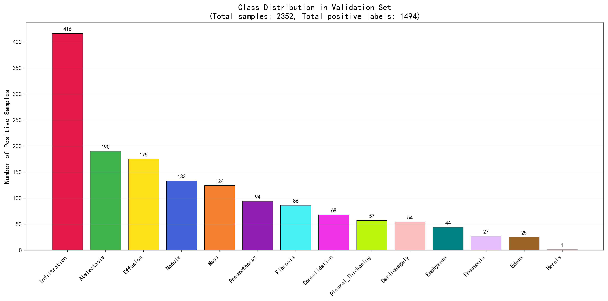
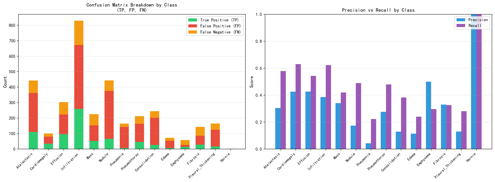
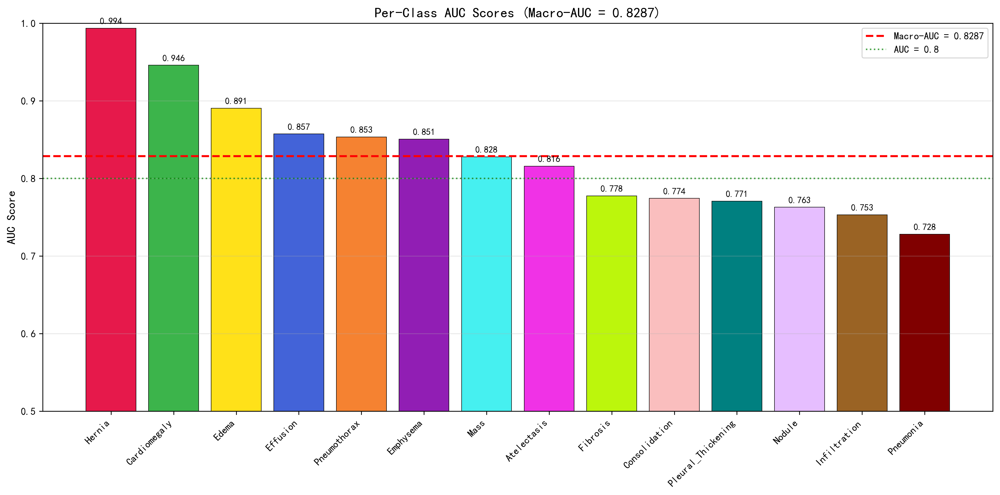
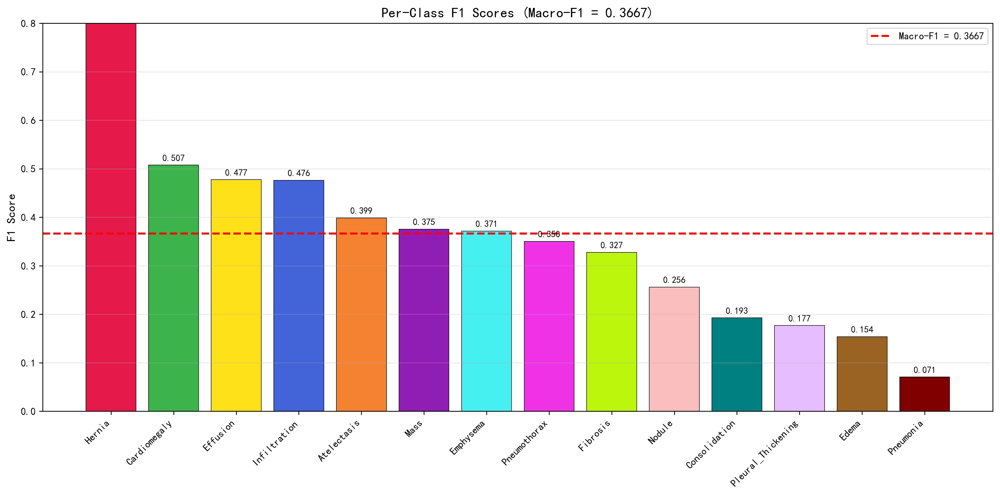

# ChestX-ray14 Multi-Label Classification

An end-to-end research project for multi-label chest X-ray classification on a filtered subset of the NIH ChestX-ray14 dataset. The project compares modern CNN and transformer backbones, uses imbalance-aware objectives, and combines complementary models with calibrated ensembling.

> **Research use only.** This repository is not a medical device and must not be used for clinical diagnosis.

## Highlights

- **14-label prediction** for common findings including Atelectasis, Cardiomegaly, Effusion, Infiltration, Mass, Nodule, Pneumonia, Pneumothorax, Consolidation, Edema, Emphysema, Fibrosis, Pleural Thickening, and Hernia.
- **High-resolution training** at 384 or 512 pixels to preserve small-lesion detail.
- **Modern backbones** from `timm`, including ConvNeXt, Swin Transformer, and CoaT.
- **Imbalance-aware training** with weighted BCE, focal loss, label smoothing, Mixup, and early stopping.
- **Patient-wise stratified splits** to keep studies from the same patient in one partition.
- **Model ensembling** with simple averaging, differential-evolution weighting, probability calibration, NNLS stacking, and per-class threshold optimization.

## Reported results

The current experiment report on the project subset shows the following validation results:

| Metric | Best single model | Best ensemble |
|:--|--:|--:|
| Macro-AUC | 0.8219 | **0.8287** |
| Macro-F1 | 0.3454 | **0.3667** |

The results were obtained on an NVIDIA RTX 4080 (12 GB). Exact scores depend on the data split, installed versions, random seeds, and available pretrained weights.

## Visual results

The repository includes the main evaluation plots generated from the validation and test predictions.

<table>
  <tr>
    <td align="center"><br><sub>Per-class metrics heatmap</sub></td>
    <td align="center"><br><sub>ROC curves across the 14 labels</sub></td>
  </tr>
  <tr>
    <td align="center"><br><sub>Precision-recall curves</sub></td>
    <td align="center"><br><sub>Per-label confusion matrices</sub></td>
  </tr>
  <tr>
    <td align="center"><br><sub>Label distribution</sub></td>
    <td align="center"><br><sub>Confusion matrix summary</sub></td>
  </tr>
  <tr>
    <td align="center"><br><sub>AUC comparison</sub></td>
    <td align="center"><br><sub>F1 comparison</sub></td>
  </tr>
</table>

## Repository layout

```text
chestxray_multilabel/
|-- train_timm_models.py       # Main ConvNeXt/Swin/CoaT training entry point
|-- ensemble_timm.py           # Timm model ensemble evaluation and optimization
|-- ensemble_timm_v0.py        # Earlier ensemble implementation
|-- scripts/
|   |-- train.py               # TorchXRayVision DenseNet baseline
|   |-- infer.py               # Single-image or batch inference utilities
|   |-- test_evaluation.py     # Final test-set evaluation
|   |-- visualize_results.py   # ROC, PR, confusion matrix, and metric plots
|   |-- ensemble_search.py     # Ensemble weight search
|   |-- ensemble_val.py        # Validation ensemble evaluation
|   +-- train_attention_crop.py # Legacy attention-guided crop entry point
|-- src/
|   |-- cxr_config.py          # Paths, labels, and training configuration
|   |-- dataset.py             # Dataset and multi-resolution transforms
|   |-- models_timm.py         # Timm model wrappers
|   |-- models.py              # TorchXRayVision model definitions
|   |-- loss_utils.py          # BCE, focal, ASL, and hybrid losses
|   |-- metrics_utils.py       # AUC/F1 metrics and threshold search
|   +-- log_utils.py           # File and console logging helpers
|-- data/filtered_labels.csv   # Filtered label metadata
|-- docs/                      # Supplementary experiment notes
|-- requirements.txt           # Pip dependencies
+-- environment.yml            # Conda environment definition
```

Model checkpoints, prediction dumps, logs, local datasets, and editor metadata are intentionally excluded from version control. The repository contains the training and evaluation code; pretrained or locally trained weights must be supplied separately.

## Installation

### Conda (recommended)

```bash
conda env create -f environment.yml
conda activate chestxray
```

### Pip / virtual environment

```bash
python -m venv .venv

# Windows PowerShell
.\.venv\Scripts\Activate.ps1

# Linux/macOS
# source .venv/bin/activate

pip install -r requirements.txt
```

Python 3.9 or newer is required. CUDA is recommended for training; the code falls back to CPU when CUDA is unavailable.

## Dataset setup

1. Obtain the NIH ChestX-ray14 images and the project label metadata through the official dataset distribution.
2. Set `NIH_DATA_ROOT` in `src/cxr_config.py` to the local dataset directory.
3. Arrange the files as follows:

```text
NIH_DATA_ROOT/
|-- images/
+-- filtered_labels.csv
```

The training pipeline uses an 80/10/10 patient-wise split. Images from one patient are kept in a single split, and rare labels are considered during stratification to make validation and test metrics more stable.

## Training

The primary training entry point is:

```bash
python train_timm_models.py
```

The main comparison includes:

| Family | Model | Input size | Approx. parameters |
|:--|:--|:--:|--:|
| CNN | ConvNeXt-Base (ImageNet-22K) | 384/512 | 89M |
| CNN | ConvNeXt-Small (ImageNet-22K) | 384 | 50M |
| Transformer | Swin-Base (ImageNet-22K) | 384 | 88M |
| Hybrid | CoaT-Lite-Medium | 384 | 45M |

For the TorchXRayVision baseline, run:

```bash
python scripts/train.py
```

Key defaults are defined in `src/cxr_config.py`:

- Timm batch size: `8`
- Training epochs: `20`
- Learning rate: `1e-4`
- Warmup: `2` epochs
- Mixup alpha: `0.1`
- Early stopping patience: `3` epochs

The default augmentation policy is deliberately conservative for medical images: moderate random resized crops, horizontal flips, small rotations, light brightness/contrast changes, and low-strength Mixup.

## Evaluation and ensembling

Evaluate trained checkpoints on the held-out test split with:

```bash
python scripts/test_evaluation.py
```

Run the ensemble evaluation with:

```bash
python ensemble_timm.py
```

The evaluation utilities report macro-AUC, macro-F1, per-class metrics, and independently optimized decision thresholds. The ensemble code supports:

1. Probability averaging and weighted averaging
2. Differential-evolution weight search
3. Isotonic probability calibration
4. Per-class non-negative least-squares (NNLS) stacking
5. Joint threshold optimization

Visual reports can be generated with:

```bash
python scripts/visualize_results.py
```

## Design notes

The project focuses on three practical issues in ChestX-ray14: tiny lesions, severe class imbalance, and noisy labels. High-resolution inputs retain more local detail; the hybrid loss combines weighted BCE, focal loss, and label smoothing; and diverse backbones provide complementary errors for ensembling.

Attention-guided cropping and two-stage loss scheduling are kept as legacy experiments in the source tree. In the current experiments they added complexity without a consistent improvement over the direct high-resolution training and ensemble pipeline.

## Outputs and checkpoints

Training writes checkpoints and validation artifacts under `saved_models/`, while logs are written to `logs/`. These paths are ignored by Git. Checkpoint extensions and generated prediction archives are also ignored globally so that large model artifacts cannot be added accidentally.

Typical local outputs include:

```text
saved_models/
|-- *_best_auc.pt
|-- *_best_f1.pt
|-- *_val_preds.npz
|-- *_val_labels.npz
+-- *_val_files.npz
```

## Limitations

- The reported experiments use ImageNet-pretrained backbones and a filtered project subset rather than a complete domain-pretraining pipeline.
- Rare labels remain difficult to evaluate reliably even with stratified splits.
- Results are research benchmarks, not evidence of clinical performance.

## References

- [NIH ChestX-ray14](https://nihcc.app.box.com/v/Chestxray-NIHCC)
- [PyTorch Image Models (timm)](https://github.com/huggingface/pytorch-image-models)
- [TorchXRayVision](https://github.com/mlmed/torchxrayvision)
- [Asymmetric Loss for Multi-Label Classification](https://arxiv.org/abs/2009.14119)

## License

This project is released under the [MIT License](LICENSE). The NIH ChestX-ray14 dataset and any pretrained model weights remain subject to their respective terms of use.
